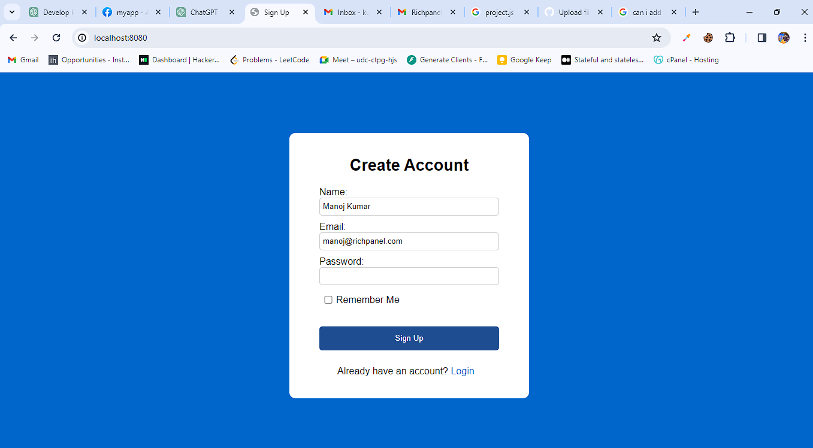
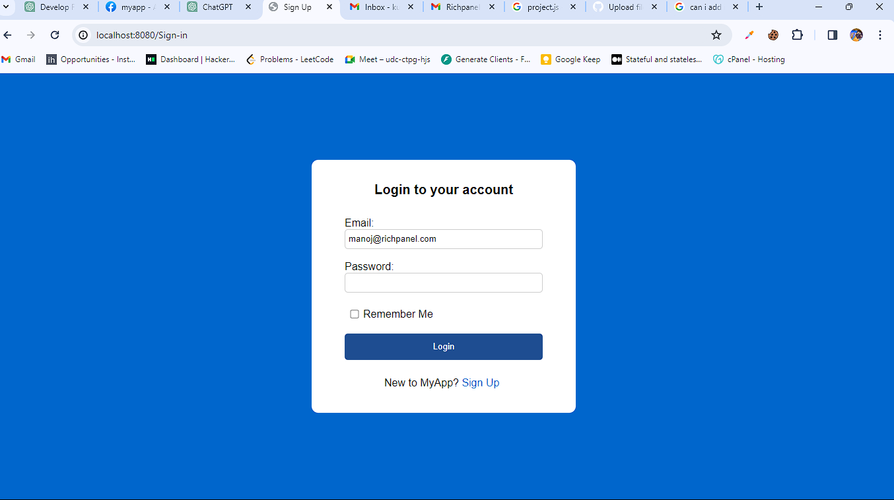
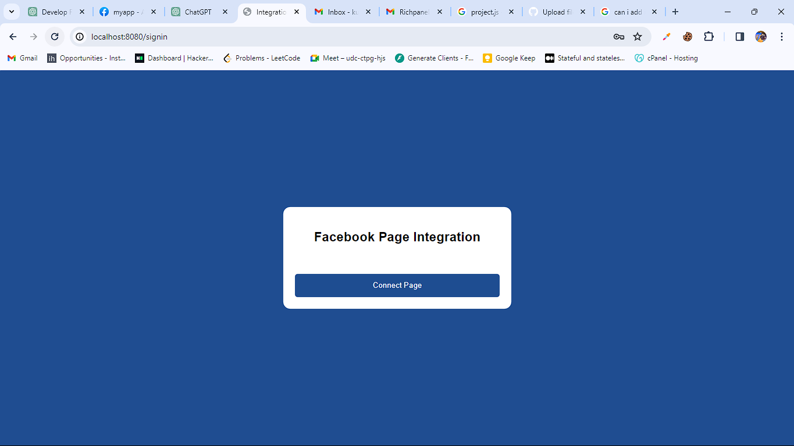
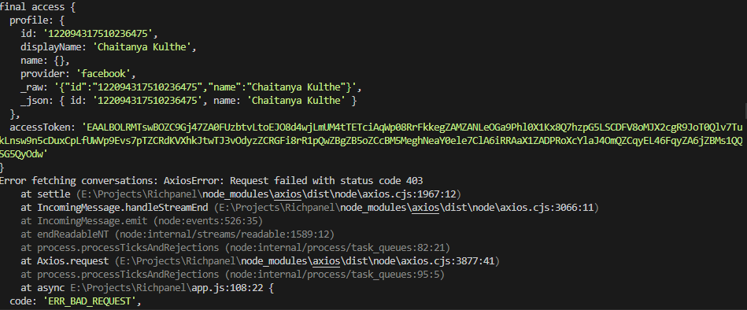

```markdown
# Facebook Integration App


## Installation:
1. Clone the repository:
   ```bash
Git clone [https://github.com/Codexnever/Richpanel.git]   ```
2. Navigate to the project directory:

3. Install dependencies:
   ```bash
   npm install
   ```

## Usage:
1. Start the server:
   ```bash
   npm start
   ```
2. Access the application in your web browser at [http://localhost:8080](http://localhost:8080).

## Tech Stack:
- **Backend:**
  - Node.js
  - Express.js
  - MongoDB
  - Passport.js
  - bcrypt
  - jsonwebtoken
  - axios

- **Frontend:**
  - Handlebars (hbs)

       

## Dependencies:
- **express:** Web framework for Node.js.
- **body-parser:** Middleware to parse incoming request bodies.
- **express-session:** Session middleware for Express.js.
- **hbs:** Handlebars.js view engine for Express.js.
- **bcrypt:** Library to hash passwords.
- **jsonwebtoken:** Library to generate and verify JSON Web Tokens (JWT).
- **mongodb:** MongoDB client for Node.js.
- **axios:** Promise-based HTTP client for the browser and Node.js.
- **passport:** Authentication middleware for Node.js.
- **passport-facebook:** Facebook authentication strategy for Passport.js.

## Authentication:
- Passport.js is used for authentication.
- Facebook OAuth is implemented using `passport-facebook` strategy.
- Users can sign in using their Facebook account, and their access token is stored in the session.
- JWT tokens are generated upon successful sign-in and are used for authentication in subsequent requests.

## Routes:
- **GET /auth/facebook:** Initiates Facebook OAuth flow.
- **GET /auth/facebook/callback:** Callback endpoint to handle OAuth callback from Facebook.
- **GET /logout:** Renders the disconnect template.
- **POST /disconnect/facebook:** Logs the user out and redirects to the sign-in page.
- **GET /integration:** Renders the connect template.
- **GET /Dashboard:** Renders the landing page with fetched conversation data.
- **GET /:** Renders the sign-up page.
- **GET /Sign-in:** Renders the sign-in page.
- **POST /signin:** Handles user sign-in with username and password.
- **POST /Signup:** Handles user sign-up with username, email, and password.

## Error Handling:
- Errors during authentication, sign-in, sign-up, and conversation fetching are logged and appropriate error responses are sent to the client.
- Detailed error messages are logged to the console for debugging purposes.
   



